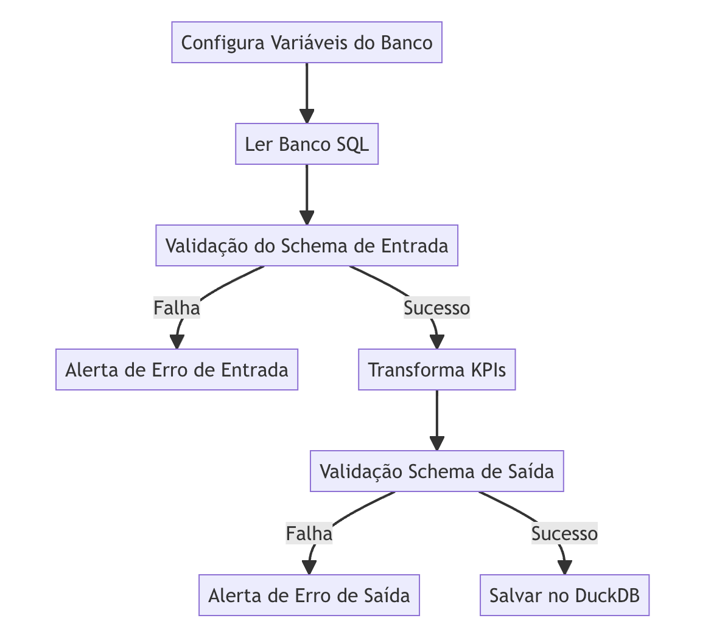

# Data Quality

O processo de qualidade de dados é importante para garantir que os dados trafegados em uma pipeline sejam confiáveis. Além disso, usando ferramentas como Pydantic e Pandera conseguimos fazer processos de validações de dados de forma mais simples.

## Sobre o projeto

Esse é um projeto de ETL de dados de produtos entre dois bancos, um Postgres e outro DuckDB.

Todos os códigos usados no banco PostgreSQL estão disponíveis [nessa pasta de SQL](sql/).

**Visite minha documentacao:**

[](https://juanveronez.github.io/data-quality/)

## Veja o que eu fiz

1. Clone o repositório:

```bash
git clone https://github.com/lvgalvao/workshop_02_aovivo.git
cd workshop_02_aovivo
```

2. Configure a versão correta do Python com `pyenv`:

```bash
pyenv install 3.11.5
pyenv local 3.11.5
```

3. Configurar poetry para Python version 3.11.5 e ative o ambiente virtual:

```bash
poetry env use 3.11.5
poetry shell
```

4. Instale as dependencias do projeto:

```bash
poetry install
```

5. Execute os testes para garantir que tudo está funcionando como esperado:

```bash
poetry run task test
```

6. Execute o comando para ver a documentação do projeto:

```bash
poetry run task test
```

7. Execute o comando de execucão da pipeline para realizar a ETL:

```bash
poetry run python app/etl.py
```
