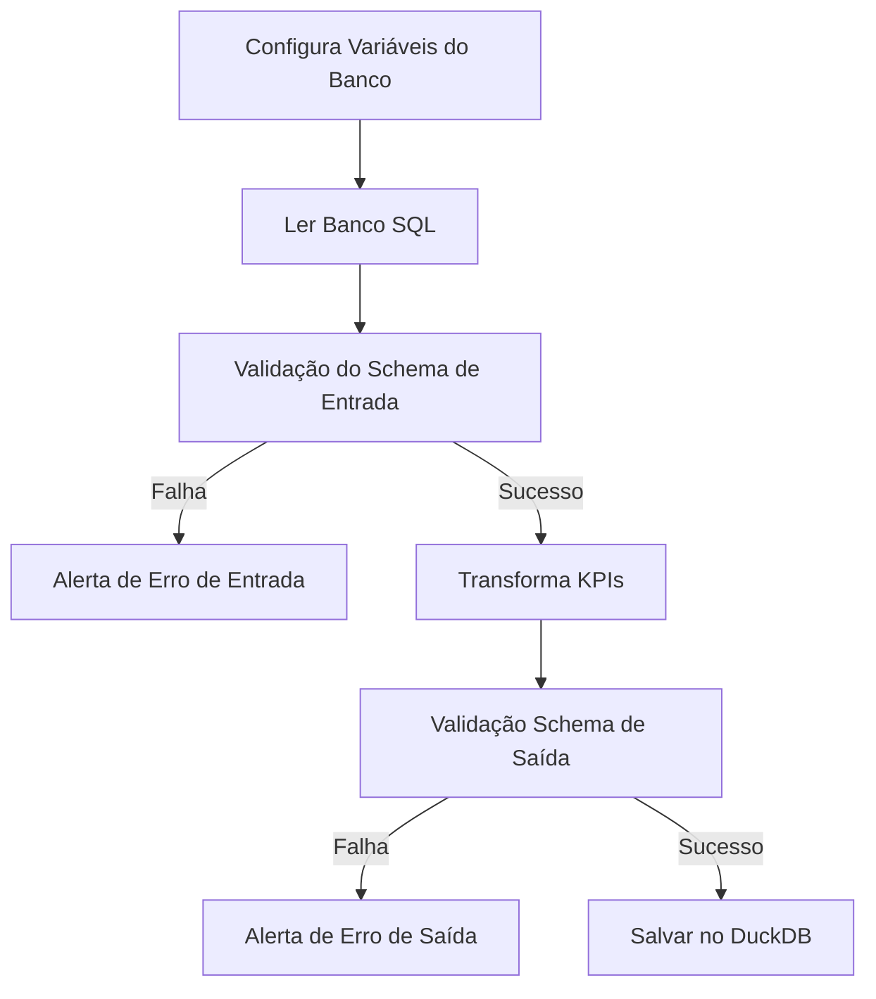

# Pipeline Data Quality

Para garantir a qualidade dos dados no processo de ETL vamos seguir os seguintes passos:

## Contratos de Dados

### ::: app.schemas.ProdutoSchema

### ::: app.schemas.ProductSchemaKPI

## Funções de ETL

### ::: app.etl.extract_db

### ::: app.etl.transform

### ::: app.etl.load_to_duckdb
